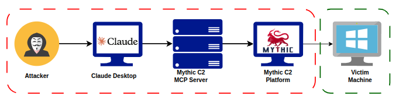

# AI-Powered Red Teaming with Claude, C2 & MCP

A project exploring the integration of *Claude, Model Context Protocol (MCP), and Command & Control (C2) Mythic* to build an AI-powered copilot for Red Team operations.

The project aims to enable Claude to interact with C2 capabilities through MCP, understand the context and results of an ongoing operation, and provide *context-aware recommendations, attack paths, and next-step actions* based on the information gathered during the engagement.

## Integration Diagram



## Requirements

1. uv
2. python3
3. Claude Desktop
4. Mythic C2 (Use docker to run the service)
5. A Windows victim machine in VMware

## Preliminary steps

1. Install and run the Mythic C2 server. You need to use the official repository and run it in Docker. Repository link: [Mythic Repository](https://github.com/its-a-feature/Mythic)
2. Install the agents (Apollo, Apfell, Poseidon) and the profiles (HTTP, WebSocket).
3. Use some of the payloads to generate a payload to send to the victim machine.
4. On the victim machine, execute the payload to obtain a session on the Mythic C2 server.

## Usage with Claude Desktop

To deploy an MCP server with Claude Desktop, we need to use the Developer Options. You will need to edit the *claude_desktop_config.json* file to configure the MCP server. The configuration format is as follows:
```
{
    "mcpServers": {
        "mythic_mcp": {
            "command": "/snap/bin/uv",
            "args": [
                "--directory",
                "/path/to/mythic_mcp/",
                "run",
                "main.py",
                "mythic_admin",
                "mythic_admin_password",
                "localhost",
                "7443"
            ]
        }
    }
}
```
To find the `mythic_admin` and `mythic_admin_password` credentials after deploying the Mythic server, you can use the following commands:
```
sudo ./mythic-cli config get admin_user
sudo ./mythic-cli config get admin_password
```